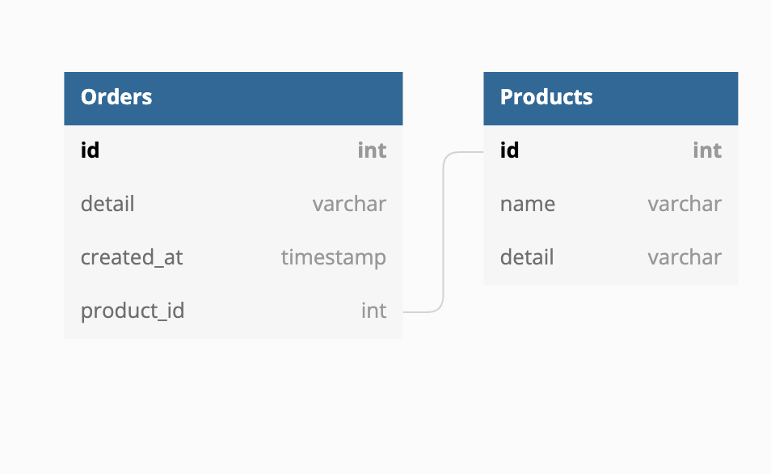
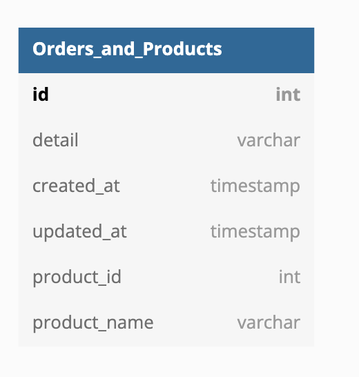

# Sync Data from MySQL to MySQL


## Background

In many cases, we need to transfer MySQL data to another MySQL, such as:

- 「Database Migration」Transfer a database of MySQL instance to another MySQL instance in the other Server/IDC/Cloud/Region.
- 「Table Aggregation and Data Development (WIP)」Merge multiple tables into one  or split one table to many with UDF

The supported versions of MySQL are shown [here](../../Connectors/pre-build-connectors.md#Mysql)

## Database Migration

### Prerequisites

#### Source 

| Filed                | **Value**                  |
| -------------------- | -------------------------- |
| Source Instance      | 192.168.1.1                |
| Source Instance Port | 3306 (Version 5.7)         |
| Source Database      | Car_shop (already created) |
| Source Tables        | All the table in Car_shop  |

#### Target 

| Filed                | **Value**                  |
| -------------------- | -------------------------- |
| Target Instance      | 192.168.1.2                |
| Target Instance Port | 3306 (Version 5.7)         |
| Target Database      | Car_shop (already created) |

### Action

```
> # Create Source DataSource
> Source_Mysql = DataSource("mysql","Source_Mysql",'source').host("192.168.1.1").port(3306).username('root').password('password').db('Car_shop')
> Source_Mysql.save()

# Create Target DataSource
> Target_Mysql = DataSource("mysql","Target_Mysql",'target').host("192.168.1.2").port(3306).username('root').password('password').db('Car_shop')
> Target_Mysql.save()

# Create a job that transform all the tables in Source_Mysql to Target_Mysql.
> migration_job = Pipeline("migration_job").readFrom(Source(Source_Mysql,table_re=".*")).writeTo(Target_Mysql)

> migration_job.start()

# Check the status of job
> show jobs
> monitor job migration_job

# Check the log of job
> logs job migration_job limit=5 tail=True 
```

After these steps you can login to the  target MySQL and see the new data.

## Table Aggregation and Data Development（WIP）

### Prerequisites

#### Source 

| Filed                | **Value**                  |
| -------------------- | -------------------------- |
| Source Instance      | 192.168.1.1                |
| Source Instance Port | 3306 (Version 5.7)         |
| Source Database      | Car_shop (already created) |
| Source Tables        | Orders<br />Products       |

#### Target 

| Filed                | **Value**                             |
| -------------------- | ------------------------------------- |
| Target Instance      | 192.168.1.2                           |
| Target Instance Port | 3306 (Version 5.7)                    |
| Target Database      | Car_shop                              |
| Target Table         | Orders_and_Products (already created) |

#### Requirement







### Action

```
# Write the js script  「find_product_name.js」

	record["updated_at"] = new Date();
	var rs = source.executeQuery({
		sql: "select name from products where  id = " + record.product_id + " limit 1"
	});
	if (rs) {
		record["product_name"] = rs[0].name;
	} else {
		log.warn("Unable to find product_name is products tabel with : " + record.product_id);
		record["product_name"] = "Not Found";
	}
	return record;

```


```
> # Create Source DataSource
> Source_Mysql = DataSource("mysql","Source_Mysql",'source').host("192.168.1.1").port(3306).username('root').password('password').db('Car_shop')
> Source_Mysql.save()

# Create Target DataSource
> Target_Mysql = DataSource("mysql","Target_Mysql",'target').host("192.168.1.2").port(3306).username('root').password('password').db('Car_shop')
> Target_Mysql.save()

# Create a job that transform from Source_Mysql to Target_Mysql.

> migration_job = Pipeline("migration_job").readFrom(Source_Mysql.Orders).filterColumn(["id","detail","created_at","product_id"],FilterType.keep).js("/path/find_product_name.js").writeTo("Target_Mysql.Orders_and_Products",writeMode=WriteMode.upsert, association=[("id", "id")])


> migration_job.start()

# Check the status of job
> show jobs
> monitor job migration_job

# Check the log of job
> logs job migration_job limit=5 tail=True 
```

After these steps you can login to the  target MySQL and see the new data.